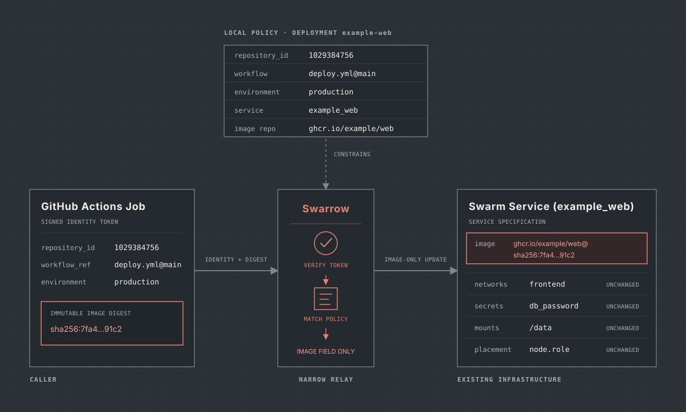

# Swarrow

Swarrow is a small deployment relay for Docker Swarm. It lets an authorised GitHub Actions workflow update the image of one preconfigured service without giving the workflow SSH access or access to the Docker API.

## Motivation

A Docker Swarm operator may manage service topology centrally while individual application repositories build and publish their own container images. Most application releases only need to replace the image of an existing service.

The usual automation options grant considerably more authority than that task requires. SSH access to a manager, membership of the `docker` group and direct access to the Docker API can all control the wider host or swarm.

Swarrow is intended to provide one narrow handoff:



The workflow supplies an immutable image digest. Swarrow determines whether the workflow may use that deployment target, constructs the approved image reference and updates the existing service.

For the broader motivation behind these boundaries, read [Swarrow: The Deployment Capability I Actually Needed](https://kingori.co/swarrow-the-deployment-capability-i-actually-needed/).

## Security boundary

An authorised workflow may:

- Deploy an immutable digest from one approved image repository
- Update the image of one preconfigured Swarm service
- Observe the result of that deployment

It may not choose another service or image repository, alter the service's configuration or make arbitrary Docker API requests.

Changing a service's image still allows the application repository to run arbitrary code with that service's existing secrets, networks, storage and privileges. Swarrow limits control-plane authority; it does not sandbox the application workload.

## Design

The design is documented in:

- [Design](docs/design.md)
- [Threat model](docs/threat-model.md)
- [Configuration](docs/configuration.md)
- [HTTP API](docs/http-api.md)
- [Deployment](docs/deployment.md)

The design and threat model describe Swarrow's contract and security boundaries. The configuration, HTTP API and deployment documents describe its interfaces and operation.

## Development

Swarrow uses the Go version declared in `go.mod` and `mise.toml`. Install the pinned toolchain with [mise](https://mise.jdx.dev/):

```sh
mise install
```

Build the executable with:

```sh
mise exec -- make build
```

The build is written to `bin/swarrow`. Development builds report `dev` through both `swarrow version` and `swarrow --version`.

Verify module dependencies and run the formatting, vet and test checks used by continuous integration before submitting a change:

```sh
mise exec -- go mod verify
mise exec -- gofmt -l .
mise exec -- go vet ./...
mise exec -- go test ./...
```

The formatting check should produce no output.

The executable entry point lives in `cmd/swarrow`. Testable Cobra command construction lives in `internal/cli`, keeping command state local to each constructed command tree.

## Licence

Swarrow is licensed under the [Apache License 2.0](LICENSE).
